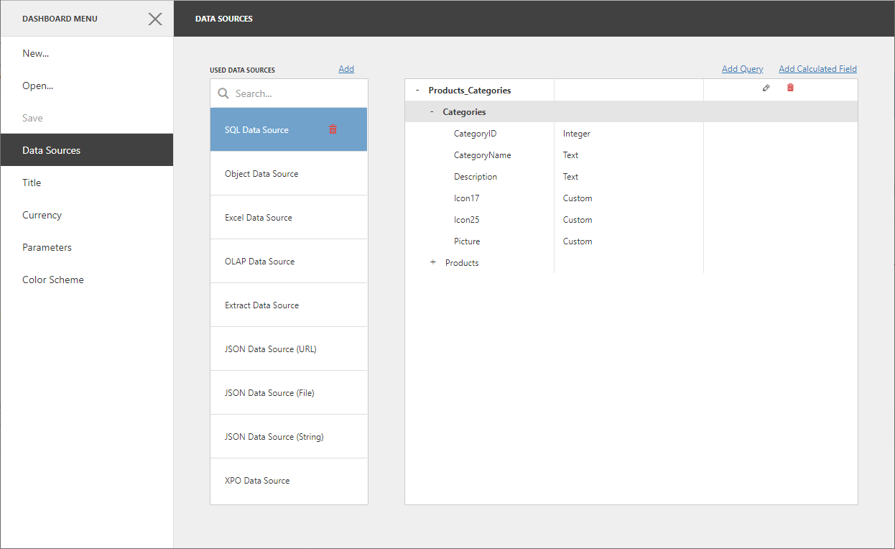

<!-- default badges list -->

<!-- default badges end -->
# BI Dashboard for ASP.NET Core - How to Register Data Sources

The following example displays how to supply a Web Dashboard with a set of predefined data sources available for users.

The [DashboardConfigurator.SetDataSourceStorage](https://docs.devexpress.com/Dashboard/DevExpress.DashboardWeb.DashboardConfigurator.SetDataSourceStorage.overloads) method is used to register the added data sources in data source storage. 

The [DashboardConfigurator.ConfigureDataConnection](https://docs.devexpress.com/Dashboard/DevExpress.DashboardWeb.DashboardConfigurator.ConfigureDataConnection) event is handled to customize connection parameters before the Web Dashboard connects to a data store (database, OLAP cube, etc.).

## Files to Review

* [EFDataSourceConfigurator.cs](./CS/WebDashboardDataSources/Configuration/EFDataSourceConfigurator.cs)
* [ExcelDataSourceConfigurator.cs](./CS/WebDashboardDataSources/Configuration/ExcelDataSourceConfigurator.cs)
* [ExtractDataSourceConfigurator.cs](./CS/WebDashboardDataSources/Configuration/ExtractDataSourceConfigurator.cs)
* [JsonDataSourceConfigurator.cs](./CS/WebDashboardDataSources/Configuration/JsonDataSourceConfigurator.cs)
* [ObjectDataSourceConfigurator.cs](./CS/WebDashboardDataSources/Configuration/ObjectDataSourceConfigurator.cs)
* [OlapDataSourceConfigurator.cs](./CS/WebDashboardDataSources/Configuration/OlapDataSourceConfigurator.cs)
* [SqlDataSourceConfigurator.cs](./CS/WebDashboardDataSources/Configuration/SqlDataSourceConfigurator.cs)
* [XpoDataSourceConfigurator.cs](./CS/WebDashboardDataSources/Configuration/XpoDataSourceConfigurator.cs)
* [Startup.cs](./CS/WebDashboardDataSources/Startup.cs)

## Documentation

- [Register Default Data Sources](https://docs.devexpress.com/Dashboard/116482/web-dashboard/dashboard-backend/register-default-data-sources)

## See Also

- [How to Register Data Sources for ASP.NET Web Forms Dashboard Control](https://github.com/DevExpress-Examples/asp-net-web-forms-dashboard-register-data-sources)
- [How to Register Data Sources for ASP.NET MVC Dashboard Extension](https://github.com/DevExpress-Examples/asp-net-mvc-dashboard-register-data-sources)
<!-- feedback -->
## Does this example address your development requirements/objectives?

 

(you will be redirected to DevExpress.com to submit your response)
<!-- feedback end -->
